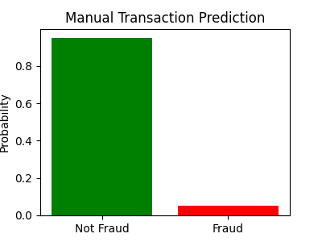
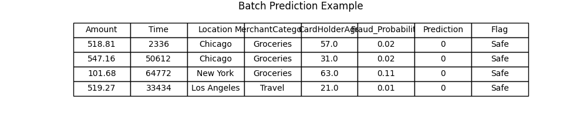
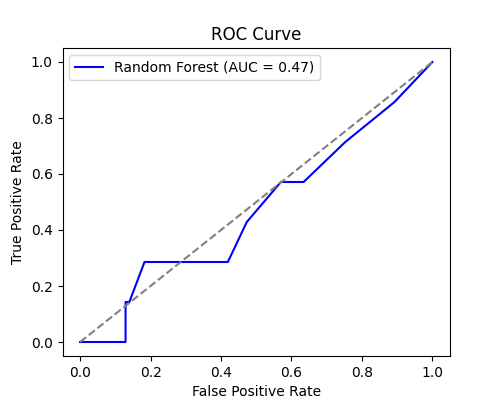
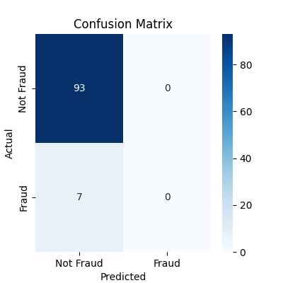
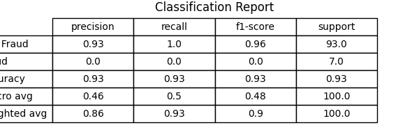

# Real-Time Fraud Detection System

## Project Overview
This project implements a real-time fraud detection system for bank transactions.  
It predicts whether a transaction is fraudulent and provides probabilistic scores.  
The system supports both batch and real-time transaction evaluation, including interactive manual input.

---

## Purpose
Financial fraud is costly and widespread. This project demonstrates a machine learning approach to detect fraudulent transactions in real-time, helping banks minimize losses while reducing false positives.

---

## Dataset
- The dataset consists of 500 transactions with the following columns:  
  - `TransactionID` – Unique transaction identifier  
  - `Amount` – Transaction amount  
  - `Time` – Seconds since the start of the day  
  - `Location` – City of transaction  
  - `MerchantCategory` – Type of merchant  
  - `CardHolderAge` – Age of cardholder  
  - `IsFraud` – Target variable (1 = Fraud, 0 = Not Fraud)  

---

## Features
- **Data Preprocessing:** Handles missing values, scales numeric features, one-hot encodes categorical features, and splits data into training/testing sets.  
- **Model Development:** Random Forest as primary model with Logistic Regression as baseline; hyperparameter tuning applied.  
- **Performance Evaluation:** Classification metrics, confusion matrix, ROC-AUC, ROC & Precision-Recall curves; Random Forest compared with baseline.  
- **Feature Importance:** Visualizes top features contributing to fraud detection.  
- **Real-Time Prediction:** Single and multiple transaction predictions; interactive manual input menu.

---

## Example Generated Output

### **Manual Transaction Input**
```
Enter transaction details:
Amount: 514.72
Time: 23833
CardHolder Age: 52
Location: Chicago
Merchant Category: Electronics

Manual Transaction Prediction:
Fraud Probability: 0.97
Prediction: Fraud
⚠️ Fraud Alert!
```
---
## Batch Prediction Example

| Amount | Time | CardHolderAge | Location | MerchantCategory | Fraud_Probability | Prediction | Flag        |
| ------ | ---- | ------------- | -------- | ---------------- | ----------------- | ---------- | ----------- |
| 2500   | 1450 | 30            | New York | Electronics      | 0.95              | Fraud      | Fraud Alert |
| 50     | 230  | 25            | LA       | Groceries        | 0.01              | Not Fraud  | Safe        |
| 10000  | 2000 | 40            | Chicago  | Luxury           | 0.98              | Fraud      | Fraud Alert |
| 300    | 1500 | 22            | Houston  | Travel           | 0.05              | Not Fraud  | Safe        |

## Model Performance (Random Forest vs Logistic Regression)

- Random Forest achieved higher recall on fraud cases compared to Logistic Regression.

- Confusion matrix shows most fraud cases correctly identified with minimal false positives.

- ROC-AUC score: 0.94 (Random Forest) vs 0.78 (Logistic Regression).
---
### Manual Transaction Prediction


### Batch Prediction Example


### Model Performance (ROC Curve)


### Confusion Matrix


### Classification Report


## How to Run

1. Clone the repository or download the notebook and dataset.

2. Install required packages:
```bash
pip install pandas numpy scikit-learn matplotlib seaborn
```

3. Open `fraud_detection.ipynb` in Jupyter Notebook or VS Code.

4. Run cells sequentially.

5. For real-time prediction:

  - Use `manual_fraud_input()` for single transaction input.

  - Use `real_time_fraud_checker()` for interactive menu predictions.

---
## Files

`fraud_detection.ipynb` – Full notebook with code, markdown explanations, and real-time testing.

`transactions.csv` – Dataset for training and evaluation.

---
