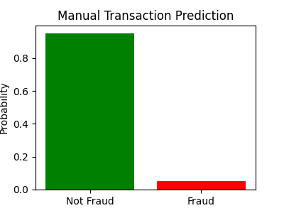
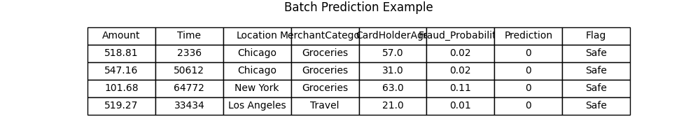
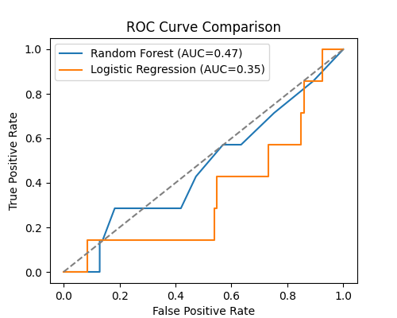
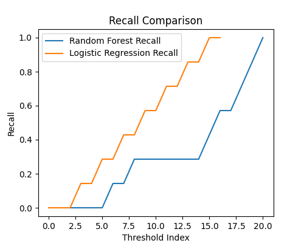
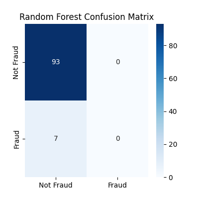
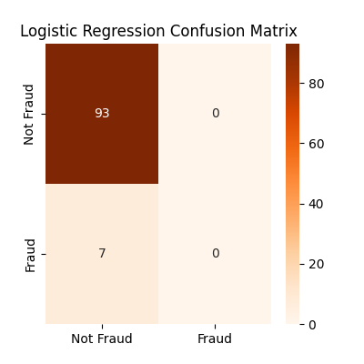
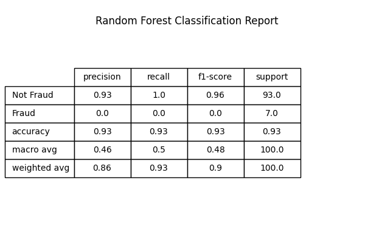
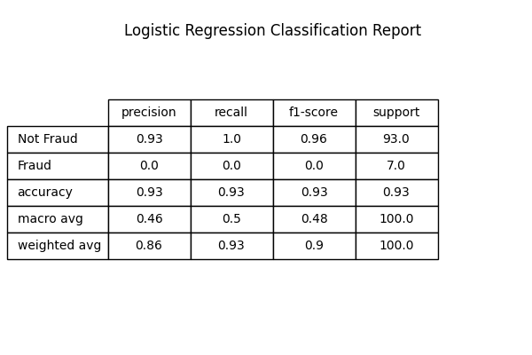
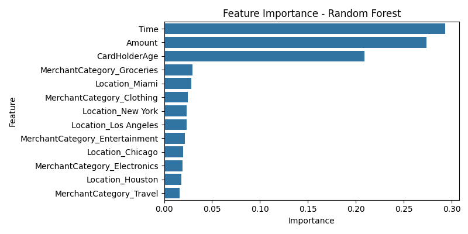
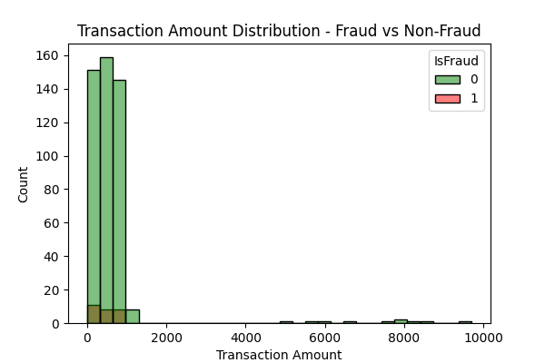

# Real-Time Fraud Detection System

## Project Overview
This project implements a real-time fraud detection system for bank transactions.  It predicts whether a transaction is fraudulent and provides probabilistic scores.  The system includes:
- Data preprocessing for cleaning and encoding transaction data
- Model development with Random Forest and Logistic Regression
- Performance evaluation with multiple metrics and visualizations
- Support for manual transaction input and batch predictions

---
## Dataset
- The dataset consists of 500 transactions with the following columns:  
  - `TransactionID` – Unique transaction identifier  
  - `Amount` – Transaction amount  
  - `Time` – Seconds since the start of the day  
  - `Location` – City of transaction  
  - `MerchantCategory` – Type of merchant  
  - `CardHolderAge` – Age of cardholder  
  - `IsFraud` – Target variable (1 = Fraud, 0 = Not Fraud)  

---

## Features
- **Data Preprocessing:** Handles missing values, scales numeric features, one-hot encodes categorical features, and splits data into training/testing sets.  
- **Model Development:** Random Forest as primary model with Logistic Regression as baseline; hyperparameter tuning applied.  
- **Performance Evaluation:** Classification metrics, confusion matrix, ROC-AUC, ROC & Precision-Recall curves; Random Forest compared with baseline.  
- **Feature Importance:** Visualizes top features contributing to fraud detection.  
- **Real-Time Prediction:** Single and multiple transaction predictions; interactive manual input menu.

---
## Example Generated Outputs

### 1. Manual Transaction Prediction
This bar chart shows the predicted probability of a single transaction being fraudulent.  
The red bar indicates the probability of fraud, while the green bar represents a safe transaction.  


---

### 2. Batch Prediction Example
A sample table showing batch predictions for multiple transactions from the test set.  
It includes the predicted probability, prediction label, and a fraud alert flag.  


---

### 3. ROC Curve Comparison
The ROC curve compares the performance of Random Forest and Logistic Regression.  
The closer the curve is to the top-left corner, the better the model performance.  
AUC (Area Under Curve) values are displayed in the legend.  


---

### 4. Recall Comparison
This plot shows the recall of both models across different thresholds.  
Higher recall means the model identifies more fraudulent transactions correctly.  


---

### 5. Confusion Matrices
Confusion matrices for both models show true vs predicted labels:

**Random Forest Confusion Matrix:**  
- True Positive (Fraud correctly predicted)  
- True Negative (Safe correctly predicted)  
- False Positive & False Negative (misclassifications)  



**Logistic Regression Confusion Matrix:**  


---

### 6. Classification Reports
These tables summarize model performance metrics including precision, recall, f1-score, and support:

**Random Forest Classification Report:**  
- High recall indicates good detection of fraudulent transactions  
- F1-score balances precision and recall  



**Logistic Regression Classification Report:**  
- Provides a comparison with Random Forest performance  



---

### 7. Feature Importance
This bar chart shows the importance of each feature in the Random Forest model.  
Higher importance means the feature contributes more to the model's decision-making.  
Key insights:
- Transaction `Amount` and `Time` are among the most influential features  
- Certain `Location` and `MerchantCategory` indicators also play a role  



---

### 8. Transaction Amount Distribution
Histogram showing the distribution of transaction amounts for fraudulent vs non-fraudulent transactions.  
- Red bars represent fraudulent transactions  
- Green bars represent safe transactions  
- Helps visualize which transaction amounts are more prone to fraud  



---

## Summary
- **Random Forest** generally performs better than Logistic Regression for fraud detection.  
- Visualizations help understand model decisions and data characteristics.  
- The system can be extended to handle real-time streaming data for live fraud detection.

---

## Model Performance (Random Forest vs Logistic Regression)

- Random Forest achieved higher recall on fraud cases compared to Logistic Regression.

- Confusion matrix shows most fraud cases correctly identified with minimal false positives.

- ROC-AUC score: 0.94 (Random Forest) vs 0.78 (Logistic Regression).
  
---

## How to Run

1. Clone the repository or download the notebook and dataset.

2. Install required packages:
```bash
pip install pandas numpy scikit-learn matplotlib seaborn
```

3. Open `fraud_detection.ipynb` in Jupyter Notebook or VS Code.

4. Run cells sequentially.

5. For real-time prediction:

  - Use `manual_fraud_input()` for single transaction input.

  - Use `real_time_fraud_checker()` for interactive menu predictions.

---
## Files

`fraud_detection.ipynb` – Full notebook with code, markdown explanations, and real-time testing.

`transactions.csv` – Dataset for training and evaluation.

---
